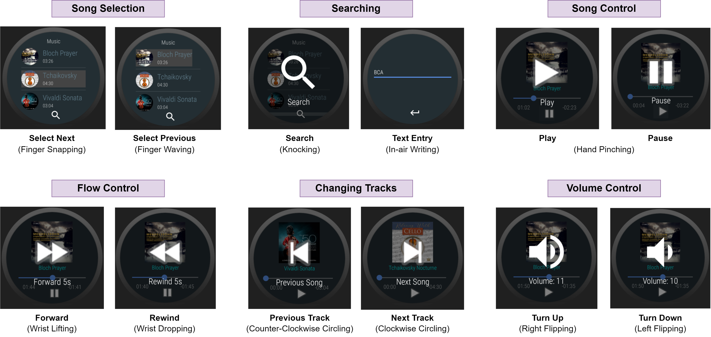
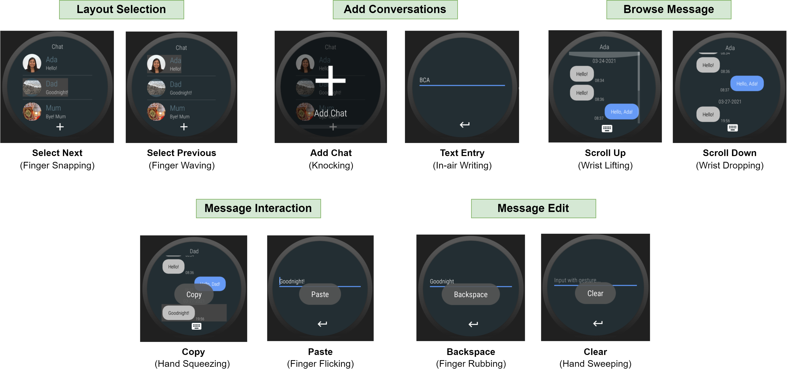

# Sensor based Smartwatch gesture recognition
Repository containing the code for the final year project: "Gestures-based Touch-Free smartwatch development with deep learning"

The goal of this project is to classify different scales of single-hand gestures, including finger motions and finger writing on a smartwatch based on the IMU data with deep learning. Our classifier distinguishes 20 gestures.

The application is operated on an Android Wear smartwatch with a microphone and IMU sensor. Huawei Smartwatch 2 2018 is used for this project.

## Dataset Download
The raw dataset can be downloaded from [here](https://portland-my.sharepoint.com/:f:/g/personal/hthon3-c_my_cityu_edu_hk/En6m7fdbKKtBnHskqa4XYOYBfNA4w_E_HWUvbfoRtThLmg?e=afFv0Z).
The entire `dataset` folder need to be placed inside the `Model` folder.

## Application Instances
This project built different real-life applications around our classification system for smartwatch control.
 
### Music Player Application

### Conversational Application

## Gathering your own data
Install the Wear OS app on the smartwatch and the Android app on the mobile. Start both applications to enter the data collection mode. 
Press the 'Start' button on the smartwatch for motion sampling. 
The motion data will be transferred to the mobile through Bluetooth for storing purposes. 

## Training new model
All the necessary scripts for data preprocessing and model training are put in the `Model` folder. Execute the `main.py` will prompt the interface to start the desired script. 

First, execute `Data Preprocessing` script to preprocess the data inside `dataset` folder with option `With Augmentation`. The resulting dataset will be saved as single csv file in `result_dataset` folder.

Then, execute the `Model Training` script to train the model with the resulting dataset / copy the trained model from the corresponding sub folder outside the `saved_model` directory. The trained model will be saved as `.h5` and `.tflite` format in the same directory.

Lastly, you can also run different experiments such as `Leave-one-person-out cross-validation` or `All data validation` to evaluate the performance of the trained model placed in `saved_model` directory.

## Running the Wear OS application
Place the `.tflite` file in the `ml` folder for both `mobile` and `wear` folder in the android project and install the app again.